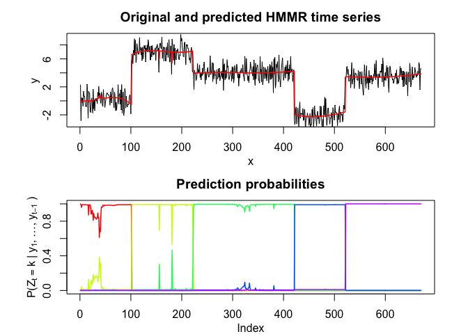
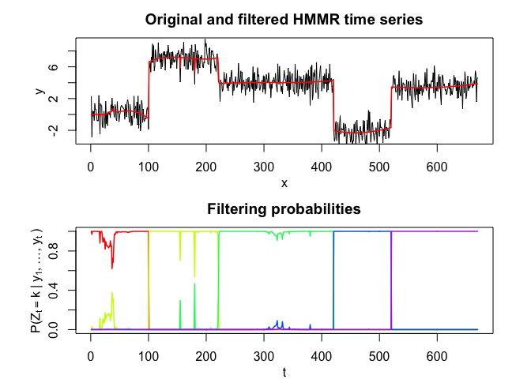
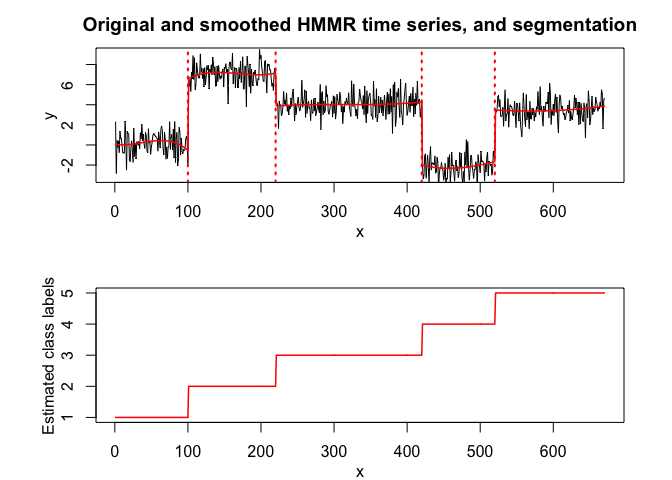

<!-- README.md is generated from README.Rmd. Please edit that file -->

## Overview

<!-- badges: start -->

<!-- badges: end -->

User-friendly and flexible algorithm for time series **segmentation**
with a Regression model with a Hidden Markov Model Regression (HMMR).

Hidden Markov Model Regression (HMMR) for segmentation of time series
with regime changes. The model assumes that the time series is governed
by a sequence of hidden discrete regimes/states, where each regime/state
has Gaussian regressors as observations. The model parameters are
estimated by MLE via the EM algorithm.

## Installation

You can install the development version of HMMR from
[GitHub](https://github.com/) with:

``` r
# install.packages("devtools")
devtools::install_github("fchamroukhi/HMMR_r")
```

To build *vignettes* for examples of usage, type the command below
instead:

``` r
# install.packages("devtools")
devtools::install_github("fchamroukhi/HMMR_r", 
                         build_opts = c("--no-resave-data", "--no-manual"), 
                         build_vignettes = TRUE)
```

Use the following command to display vignettes:

``` r
browseVignettes("HMMR")
```

## Usage

``` r
library(HMMR)

data("simulatedtimeserie")

K <- 5 # Number of regimes (states)
p <- 3 # Dimension of beta (order of the polynomial regressors)
variance_type <- "heteroskedastic" # "heteroskedastic" or "homoskedastic" model

n_tries <- 1
max_iter <- 1500
threshold <- 1e-6
verbose <- TRUE

hmmr <- emHMMR(simulatedtimeserie$X, simulatedtimeserie$Y, 
               K, p, variance_type, n_tries, max_iter, threshold, verbose)
#> EM: Iteration : 1 || log-likelihood : -1556.39696825601
#> EM: Iteration : 2 || log-likelihood : -1022.47935723687
#> EM: Iteration : 3 || log-likelihood : -1019.51830707432
#> EM: Iteration : 4 || log-likelihood : -1019.51780361388

hmmr$summary()
#> ---------------------
#> Fitted HMMR model
#> ---------------------
#> 
#> HMMR model with K = 5 components:
#> 
#>  log-likelihood nu       AIC       BIC
#>       -1019.518 49 -1068.518 -1178.946
#> 
#> Clustering table (Number of observations in each regimes):
#> 
#>   1   2   3   4   5 
#> 100 120 200 100 150 
#> 
#> Regression coefficients:
#> 
#>       Beta(K = 1) Beta(K = 2) Beta(K = 3) Beta(K = 4) Beta(K = 5)
#> 1    6.031872e-02   -5.326689    -2.65064    120.8612    3.858683
#> X^1 -7.424715e+00  157.189455    43.13601   -474.9870   13.757279
#> X^2  2.931651e+02 -643.706204   -92.68115    598.3726  -34.384734
#> X^3 -1.823559e+03  855.171715    66.18499   -244.5175   20.632196
#> 
#> Variances:
#> 
#>  Sigma2(K = 1) Sigma2(K = 2) Sigma2(K = 3) Sigma2(K = 4) Sigma2(K = 5)
#>       1.220624      1.111487      1.080043     0.9779724      1.028399

hmmr$plot()
```


