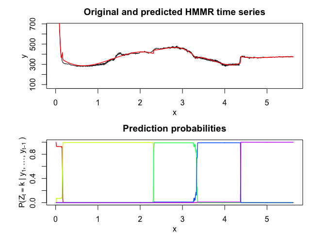

<!-- README.md is generated from README.Rmd. Please edit that file -->

<!-- badges: start -->

<!-- badges: end -->

# Overview

User-friendly and flexible algorithm for time series **segmentation**
with a regression model governed by a hidden Markov process.

Hidden Markov Model Regression (HMMR) for segmentation of time series
with regime changes. The model assumes that the time series is governed
by a sequence of hidden discrete regimes/states, where each regime/state
has Gaussian regressors as observations. The model parameters are
estimated by MLE via the EM algorithm.

# Installation

You can install the development version of HMMR from
[GitHub](https://github.com/) with:

``` r
# install.packages("devtools")
devtools::install_github("fchamroukhi/HMMR_r")
```

To build *vignettes* for examples of usage, type the command below
instead:

``` r
# install.packages("devtools")
devtools::install_github("fchamroukhi/HMMR_r", 
                         build_opts = c("--no-resave-data", "--no-manual"), 
                         build_vignettes = TRUE)
```

Use the following command to display vignettes:

``` r
browseVignettes("HMMR")
```

# Usage

``` r
library(HMMR)
```

``` r
# Application to a toy data set
data("toydataset")

K <- 5 # Number of regimes (states)
p <- 3 # Dimension of beta (order of the polynomial regressors)
variance_type <- "heteroskedastic" # "heteroskedastic" or "homoskedastic" model

n_tries <- 1
max_iter <- 1500
threshold <- 1e-6
verbose <- TRUE

hmmr <- emHMMR(toydataset$x, toydataset$y, K, p, variance_type, n_tries, 
               max_iter, threshold, verbose)
#> EM: Iteration : 1 || log-likelihood : -1556.39696825601
#> EM: Iteration : 2 || log-likelihood : -1022.47935723687
#> EM: Iteration : 3 || log-likelihood : -1019.51830707432
#> EM: Iteration : 4 || log-likelihood : -1019.51780361388

hmmr$summary()
#> ---------------------
#> Fitted HMMR model
#> ---------------------
#> 
#> HMMR model with K = 5 components:
#> 
#>  log-likelihood nu       AIC       BIC
#>       -1019.518 49 -1068.518 -1178.946
#> 
#> Clustering table (Number of observations in each regimes):
#> 
#>   1   2   3   4   5 
#> 100 120 200 100 150 
#> 
#> Regression coefficients:
#> 
#>       Beta(K = 1) Beta(K = 2) Beta(K = 3) Beta(K = 4) Beta(K = 5)
#> 1    6.031872e-02   -5.326689    -2.65064    120.8612    3.858683
#> X^1 -7.424715e+00  157.189455    43.13601   -474.9870   13.757279
#> X^2  2.931651e+02 -643.706204   -92.68115    598.3726  -34.384734
#> X^3 -1.823559e+03  855.171715    66.18499   -244.5175   20.632196
#> 
#> Variances:
#> 
#>  Sigma2(K = 1) Sigma2(K = 2) Sigma2(K = 3) Sigma2(K = 4) Sigma2(K = 5)
#>       1.220624      1.111487      1.080043     0.9779724      1.028399

hmmr$plot()
```


``` r
# Application to a real data set
data("realdataset")

K <- 5 # Number of regimes (states)
p <- 3 # Dimension of beta (order of the polynomial regressors)
variance_type <- "heteroskedastic" # "heteroskedastic" or "homoskedastic" model

n_tries <- 1
max_iter <- 1500
threshold <- 1e-6
verbose <- TRUE

hmmr <- emHMMR(realdataset$x, realdataset$y2, K, p, variance_type, 
               n_tries, max_iter, threshold, verbose)
#> EM: Iteration : 1 || log-likelihood : -2733.41028643114
#> EM: Iteration : 2 || log-likelihood : -2303.24018378559
#> EM: Iteration : 3 || log-likelihood : -2295.0470677529
#> EM: Iteration : 4 || log-likelihood : -2288.57866215726
#> EM: Iteration : 5 || log-likelihood : -2281.36756202518
#> EM: Iteration : 6 || log-likelihood : -2273.50303676091
#> EM: Iteration : 7 || log-likelihood : -2261.70334656117
#> EM: Iteration : 8 || log-likelihood : -2243.43509121433
#> EM: Iteration : 9 || log-likelihood : -2116.4610801575
#> EM: Iteration : 10 || log-likelihood : -2046.73194777839
#> EM: Iteration : 11 || log-likelihood : -2046.68328282973
#> EM: Iteration : 12 || log-likelihood : -2046.67329222076
#> EM: Iteration : 13 || log-likelihood : -2046.66915144265
#> EM: Iteration : 14 || log-likelihood : -2046.66694236131
#> EM: Iteration : 15 || log-likelihood : -2046.66563379017

hmmr$summary()
#> ---------------------
#> Fitted HMMR model
#> ---------------------
#> 
#> HMMR model with K = 5 components:
#> 
#>  log-likelihood nu       AIC       BIC
#>       -2046.666 49 -2095.666 -2201.787
#> 
#> Clustering table (Number of observations in each regimes):
#> 
#>   1   2   3   4   5 
#>  14 214  99 109 126 
#> 
#> Regression coefficients:
#> 
#>     Beta(K = 1) Beta(K = 2) Beta(K = 3) Beta(K = 4) Beta(K = 5)
#> 1       2152.64   379.75158   5211.1759 -14306.4654  6417.62823
#> X^1   -12358.67  -373.37266  -5744.7879  11987.6666 -3571.94086
#> X^2  -103908.33   394.49359   2288.9418  -3233.8021   699.55894
#> X^3   722173.26   -98.60485   -300.7686    287.4567   -45.42922
#> 
#> Variances:
#> 
#>  Sigma2(K = 1) Sigma2(K = 2) Sigma2(K = 3) Sigma2(K = 4) Sigma2(K = 5)
#>       9828.793      125.3346      58.71053      105.8328      15.66317

hmmr$plot()
```



# Model selection

In this package, it is possible to select models based on information
criteria such as **BIC**, **AIC** and **ICL**.

The selection can be done for the two following parameters:

  - **K**: The number of regimes;
  - **p**: The order of the polynomial regression.

Let’s select a HMMR model for the following time series **Y**:

``` r
data("toydataset")
x = toydataset$x
y = toydataset$y

plot(x, y, type = "l", xlab = "x", ylab = "Y")
```


``` r
selectedhmmr <- selectHMMR(X = x, Y = y, Kmin = 2, Kmax = 6, pmin = 0, pmax = 3)
#> The HMMR model selected via the "BIC" has K = 5 regimes 
#>  and the order of the polynomial regression is p = 0.
#> BIC = -1136.39152222095
#> AIC = -1059.76780111041

selectedhmmr$plot(what = "smoothed")
```


